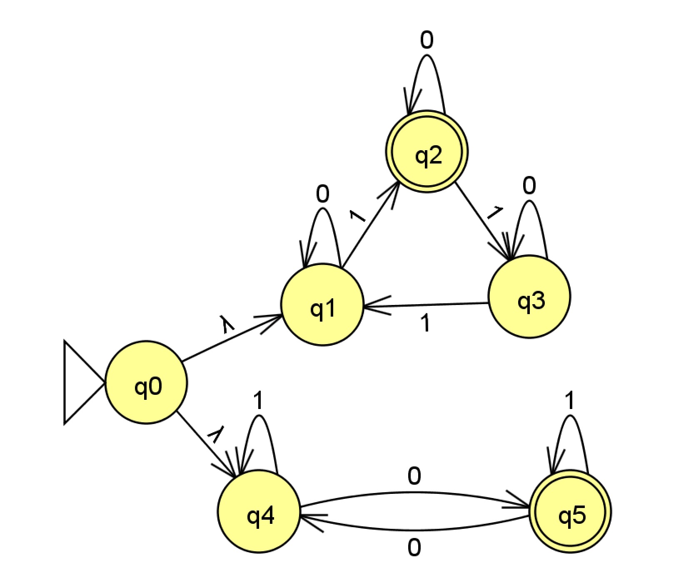
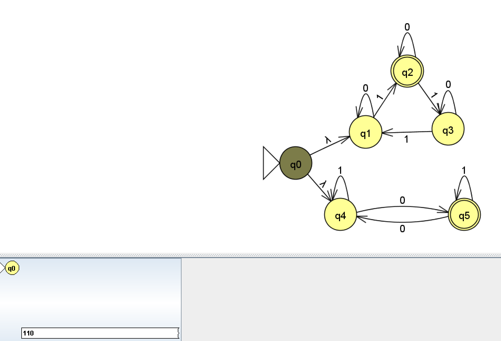
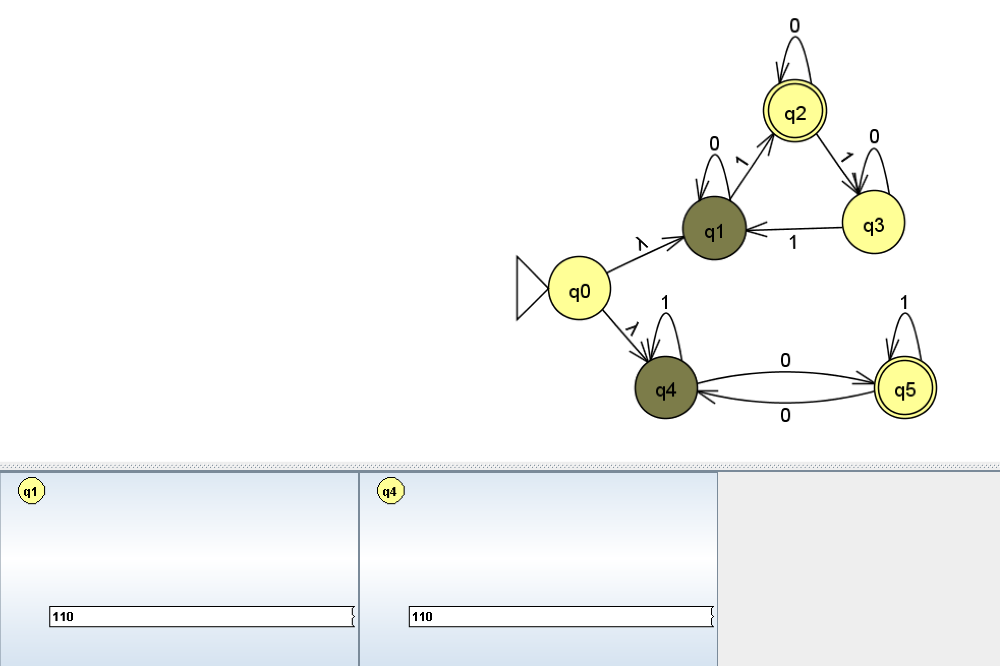
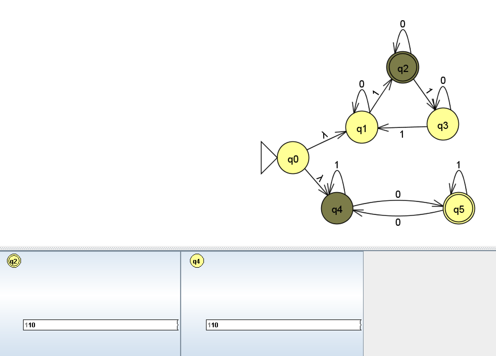
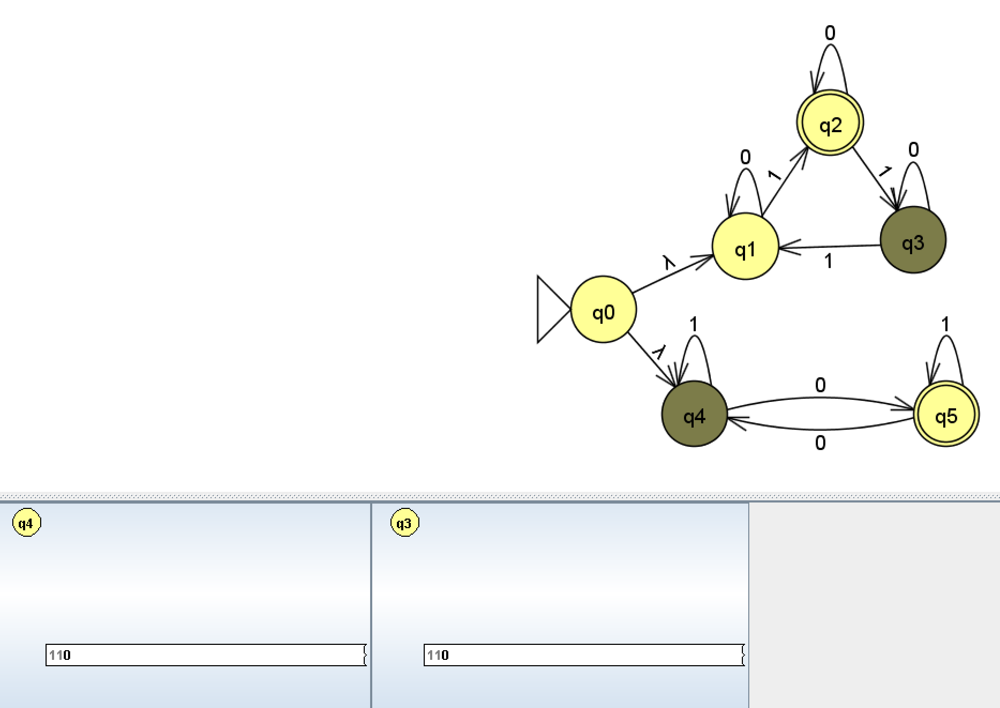
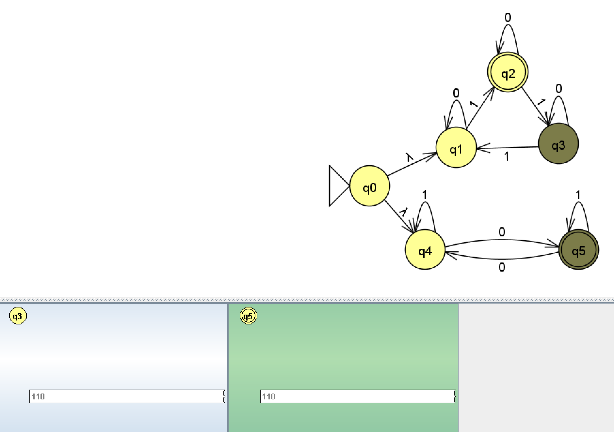

{string s| s has 3k+1 of 1's, where k>=0 or odd number of 0's} 

 "gold-st-ring"  

Why this is unexpected outcomes?: 
- Before this one I didn't add self loop in q1 to q3, which make 01111 Reject. After adding self loop 01111 will be accept, which match with statement, also same with 110

1

11

110
